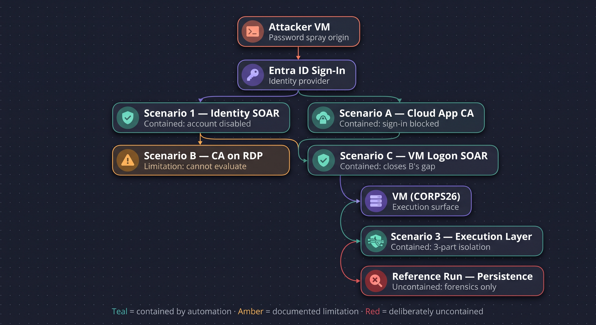

# SC-200 SOC Lab: Defense-in-Depth Kill-Chain Interruption
 
**A Microsoft Sentinel + Entra ID + Azure detection engineering lab demonstrating containment at multiple independent layers of an identity-to-endpoint attack chain.**

 **Architect:** Joshua Adeleye  
**Credentials:** [LinkedIn Profile](https://www.linkedin.com/in/joshuaadeleye) | [Microsoft SC-900 Certification](https://learn.microsoft.com/api/credentials/share/en-us/JoshuaAdeleye-9770/FB7604464D61E680)
---

## Table of Contents
 
- [Project Summary](#project-summary)
- [Why This Design](#why-this-design)
- [Architecture Overview](#architecture-overview)
- [Environment](#environment)
- [Architecture Note: Identity Model](#architecture-note-identity-model)
- [Scenario 1 — Identity Layer Containment](#scenario-1--identity-layer-containment)
- [Scenario A — Cloud App Access, Conditional Access Block](#scenario-a--cloud-app-access-conditional-access-block)
- [Scenario B — VM Logon, Risk-Based Conditional Access (Documented Limitation)](#scenario-b--vm-logon-risk-based-conditional-access-documented-limitation)
- [Scenario C — VM Logon, SOAR Response](#scenario-c--vm-logon-soar-response)
- [Scenario 3 — Execution Layer Containment](#scenario-3--execution-layer-containment)
- [Reference Run — Persistence (Intentionally Uncontained)](#reference-run--persistence-intentionally-uncontained)
- [Repository Structure](#repository-structure)
- [Lessons Learned (Notable Technical Findings)](#lessons-learned-notable-technical-findings)
- [SC-200 Domain Coverage](#sc-200-domain-coverage)
- [Decommission](#decommission)
 
## Project Summary
 
Most beginner SOC labs simulate a full attack chain and respond once, at the end, after persistence is already established. This project intentionally does the opposite: it runs the same attack chain through multiple independent detection and response layers, each tested and reset separately, to demonstrate what each individual defense actually buys a real organization on its own — and what happens when a given layer can't catch the threat at all.
 
> The original lab syllabus this project was based on delayed all containment until after persistence was established. This build instead tests containment at the identity layer, the cloud-application access layer, the VM-logon layer, and the process-execution layer independently — including one layer (risk-based Conditional Access on RDP) that was deliberately tested to failure and documented as a genuine architectural limitation rather than forced to "work."
 
---
 
## Why This Design
 
A real SOC doesn't get one shot at the end of a kill chain. Every layer — identity, cloud access, device logon, process execution — is a chance to stop an intrusion before it progresses. This lab treats each layer as its own testable scenario rather than one long chain with a single response bolted on at the end. It also treats "this control doesn't apply here" as a valid, reportable finding — several of the most useful discoveries in this build came from things that *didn't* work as expected, and understanding *why* they didn't.
 
| # | Scenario | Attack Stops At | Primary Control | Status |
|---|---|---|---|---|
| 1 | Identity Layer | Password spray → successful login | SOAR: disable account + revoke sessions | Built & validated |
| A | Cloud App Access | Cloud app sign-in from untrusted location | Conditional Access (location-based block) | Built & validated |
| B | VM Logon (risk-based) | Attempted risk-based CA block on RDP | Conditional Access (Identity Protection risk) | Built, does not function — documented as an architectural limitation |
| C | VM Logon (SOAR) | Successful RDP logon by a previously-sprayed account | SOAR: disable account + revoke sessions | Built & validated |
| 3 | Execution Layer | Encoded PowerShell execution on the VM | SOAR: 3-part NSG isolation + forced session logoff | Built & validated |
| Ref | Persistence (uncontained) | N/A — represents total containment failure | None (forensics only) | Built, intentionally uncontained |
 
---
 
## Architecture Overview
 

 
---
 
## Environment
 
**Azure**
- Resource Group: `rg-sc200-v3`
- Log Analytics Workspace + Microsoft Sentinel
- Windows Server 2022 VM (`CORPS26`) — Microsoft Entra ID Joined
- Sysmon (Olaf Hartong `sysmon-modular` config) + Azure Monitor Agent
- Data Collection Rule scoped to `Microsoft-Windows-Sysmon/Operational!*`
- Entra ID P2 (Conditional Access + Identity Protection)
- NSG restricting inbound RDP (3389) to operator's home IP only
- Attacker origin: Azure Cloud Shell / ROPC scripts against Entra ID (distinct source IP from operator's own network)
**Test identities (Entra ID only — no local Windows accounts)**
- `sjones` — the account compromised throughout the attack chain
- `jsmith`, `bwilliams` — spray targets, never compromised
**Known environment constraints, discovered during the build:**
- This tenant's Microsoft 365 E5 Developer SKU does not carry a functional Defender for Endpoint entitlement, despite the "Microsoft 365 Defender" service plan appearing enabled. All endpoint telemetry is sourced via Sysmon/Sentinel instead of Defender XDR. See [docs/mde-licensing-diagnosis.md](docs/mde-licensing-diagnosis.md).
- This environment's Data Collection Rule was configured to collect only the Sysmon event channel. Windows Security Event logs (needed for EventID 4624/4698-based correlation) were not included, discovered mid-build during the DFIR walkthrough. See [docs/securityevent-dcr-gap.md](docs/securityevent-dcr-gap.md).
- RDP access to an Entra ID Joined VM requires specific `.rdp` file properties (`enablerdsaadauth:i:1`, correct domain/auth settings) not included in the Azure Portal's default downloaded file, and requires the connecting client machine to itself be Entra registered or joined. See [docs/entra-joined-vm-rdp-setup.md](docs/entra-joined-vm-rdp-setup.md).
---
 
## Architecture Note: Identity Model
 
`sjones`, `jsmith`, and `bwilliams` exist only in Entra ID — there are no local Windows accounts on the VM. This is deliberate: a local SAM account would authenticate independently of Entra ID, meaning Conditional Access and Identity Protection would have no visibility into VM logons at all. The VM is Entra ID Joined specifically so that interactive RDP logons are real Entra sign-in events, subject to (attempted) Conditional Access evaluation and visible in `SigninLogs`.
 
---
 
## Scenario 1 — Identity Layer Containment
 
**Attack:** Controlled ROPC password spray from Cloud Shell against Entra ID test users — `jsmith` and `bwilliams` each receive 5 failed logins, `sjones` receives 1 successful login, all from the same source IP within a rolling window.
 
**Detection:** correlates failed and successful attempts by account, isolating the specific compromised identity rather than flagging every targeted account indiscriminately. See [detections/scenario1_password_spray.kql](detections/scenario1_password_spray.kql).
 
**Response:** Logic App triggered on incident creation calls Microsoft Graph API to disable the compromised account and revoke all active sign-in sessions.
 
**Outcome demonstrated:** credential compromise is neutralized before the attacker can use the stolen password anywhere else.
 
Full timeline: [reports/scenario1-timeline.md](reports/scenario1-timeline.md).
 
---
 
## Scenario A — Cloud App Access, Conditional Access Block
 
**Attack:** Using the spray-compromised credentials, an attempted cloud application sign-in (e.g. Azure Portal) as `sjones` from an untrusted network location.
 
**Control:** a Conditional Access named-location policy blocks the sign-in outright, before any Sentinel incident is ever generated.
 
**Why cloud app access, not RDP:** RDP sign-ins to an Entra-joined VM log the VM's own network position to Entra ID, not the RDP client's actual origin — so location-based Conditional Access cannot meaningfully evaluate RDP attempts. Cloud application sign-ins transmit the real client IP, making this the correct, testable use case for a location-based policy.
 
Full timeline: [reports/scenarioA-timeline.md](reports/scenarioA-timeline.md).
 
---
 
## Scenario B — VM Logon, Risk-Based Conditional Access (Documented Limitation)
 
**Attempted control:** a Conditional Access policy blocking sign-in based on Identity Protection's User Risk or Sign-in Risk level, targeting RDP access to the Entra-joined VM.
 
**Result:** this does not work, and cannot be made to work with the available infrastructure. Testing (including routing the RDP connection through a VPN exit node) confirmed that Entra ID's sign-in telemetry for RDP-to-Entra-joined-VM logons always reflects the VM's own fixed location, never the client's actual network origin — regardless of VPN, Tor, or any other client-side network change. Risk-based Conditional Access, like location-based Conditional Access, has no meaningful signal to evaluate for this access path.
 
This is documented as a genuine architectural finding, not a configuration failure: organizations relying on Conditional Access as a control for RDP-based VM access have a structural blind spot that neither location-based nor risk-based policies can close, because the underlying telemetry never carries the information CA needs to make that decision.
 
Full analysis: [reports/scenarioB-limitation-analysis.md](reports/scenarioB-limitation-analysis.md).
 
---
 
## Scenario C — VM Logon, SOAR Response
 
**Attack:** the spray-compromised `sjones` account is used to establish an RDP session directly against the VM — the access path Scenario B could not gate.
 
**Detection:** correlates the IP that conducted the original spray against any account that later authenticates successfully from that pattern, then checks whether that same account subsequently reaches the VM sign-in application — a genuine behavioral correlation between the initial compromise and the later access attempt, not a static "alert on any login" rule. See [detections/scenarioC_soar_vm_logon.kql](detections/scenarioC_soar_vm_logon.kql).
 
**Response:** Logic App disables the account and revokes sessions via Graph API, identical response pattern to Scenario 1, applied at a later, independent point in the kill chain.
 
**Notable finding:** disabling the account and revoking sessions does not terminate the attacker's already-established RDP session — cloud identity actions govern future authentication, not existing local sessions. This same behavior is independently confirmed in Scenario 3.
 
Full timeline: [reports/scenarioC-timeline.md](reports/scenarioC-timeline.md).
 
---
 
## Scenario 3 — Execution Layer Containment
 
**Attack:** from the active RDP session, `sjones` executes a base64-encoded PowerShell download cradle (`IEX (New-Object Net.WebClient).DownloadString(...)`), simulating a real-world post-compromise second-stage payload retrieval.
 
**Detection:** Sysmon Event ID 1 process creation, filtered for `powershell.exe` invoked with encoding/download-cradle indicators, with attribution correctly pulled from the event's payload-level `User` field rather than the unreliable envelope-level field that frequently reports SYSTEM regardless of the actual acting user. See [detections/scenario3_encoded_powershell.kql](detections/scenario3_encoded_powershell.kql).
 
**Response — three-part containment, not VM restart:**
1. NSG allow rule (priority 100) preserving the analyst's own access for continued investigation
2. NSG deny-all rule (priority 110) blocking all new connections
3. Azure Run Command forcibly logging off the attacker's already-active session
**Why not restart:** Azure NSGs are stateful at connection setup only — a new deny rule does not terminate an already-established session. A VM restart would achieve eviction but destroys volatile forensic evidence (running processes, memory, open connections), a recognized incident-response anti-pattern. This three-part design achieves near-immediate eviction, ongoing lockout, and retained investigative access without destroying evidence.
 
Full timeline: [reports/scenario3-timeline.md](reports/scenario3-timeline.md).
Full investigation walkthrough: [reports/scenario3-investigation-walkthrough.md](reports/scenario3-investigation-walkthrough.md).
 
---
 
## Reference Run — Persistence (Intentionally Uncontained)
 
Represents the outcome if every layer above had failed. `sjones` establishes scheduled-task and registry Run-key persistence, with no automated response — this run exists purely to demonstrate what forensic evidence remains to be found after the fact, and to show why relying on a single, late-stage response point (as the original lab syllabus did) is an unrealistic model of SOC operations.
 
Full report: [reports/reference-persistence-run.md](reports/reference-persistence-run.md).
 
---
 
## Repository Structure
 
```
sc200-defense-in-depth-lab/
├── cost-report/
├── detections/
├── diagrams/
├── docs/
├── hunting/
├── playbook/
├── reports/
└── screenshots/
```
 
---
 
## Lessons Learned (Notable Technical Findings)
 
- **Sysmon Event ID 12 vs 13** — registry *value* modifications (e.g. `reg add` on an existing key) log as Event ID 13, not 12 (key creation/deletion only). See [docs/event-id-12-vs-13-lessons-learned.md](docs/event-id-12-vs-13-lessons-learned.md).
- **Envelope vs payload user attribution** — the generic `Event` table's top-level `UserName` field often reflects the log-writing service's own context (frequently SYSTEM), not the actual acting user. Correct attribution requires extracting the `User` field from inside the event's own payload data. See [docs/envelope-vs-payload-user-field.md](docs/envelope-vs-payload-user-field.md).
- **RDP-to-Entra-joined-VM location blindness** — this authentication path never transmits the client's real network origin to Entra ID, making both location-based and risk-based Conditional Access structurally unable to evaluate it (Scenario B). See [docs/ca-vs-nsg-rdp-limitation.md](docs/ca-vs-nsg-rdp-limitation.md).
- **Cloud identity actions do not equal session termination** — disabling an account and revoking sign-in sessions stops future authentication but does not drop an already-established RDP session, confirmed independently in both Scenario C and Scenario 3.
- **M365 Developer SKU licensing gap** — a service plan can appear enabled in the tenant's license list without a functional underlying entitlement, diagnosed through systematic elimination rather than configuration changes. See [docs/mde-licensing-diagnosis.md](docs/mde-licensing-diagnosis.md).
- **DCR scope gaps are easy to miss silently** — a Data Collection Rule configured for one event channel (Sysmon) will not surface data from another (Windows Security Events) even though both appear to be part of "the same" Windows telemetry pipeline. See [`docs/securityevent-dcr-gap.md`](docs/securityevent-dcr-gap.md).
---
 
## SC-200 Domain Coverage
 
| Domain | Covered By |
|---|---|
| Manage security operations | Environment build, DCR/connector configuration, licensing and telemetry troubleshooting |
| Detect threats using Sentinel | Scenario 1, A, C, and 3 detection queries; entity mapping; behavioral correlation logic |
| Respond to incidents | Scenario 1, C, and 3 SOAR playbooks; Scenario B's documented control failure |
| Threat hunting | DFIR walkthrough ([reports/scenario3-investigation-walkthrough.md](reports/scenario3-investigation-walkthrough.md)); reference persistence hunt |
 
---
 
## Decommission
 
Azure VM deallocated and `rg-sc200-v3` resource group deleted at project completion to halt billing. Cost report exported to [cost-report/](cost-report/).
