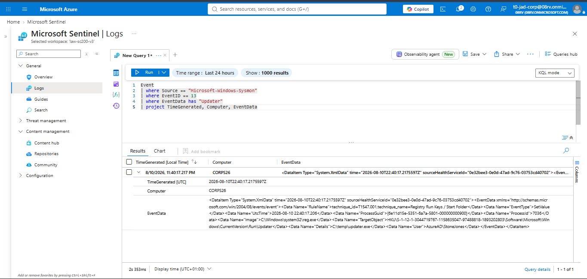
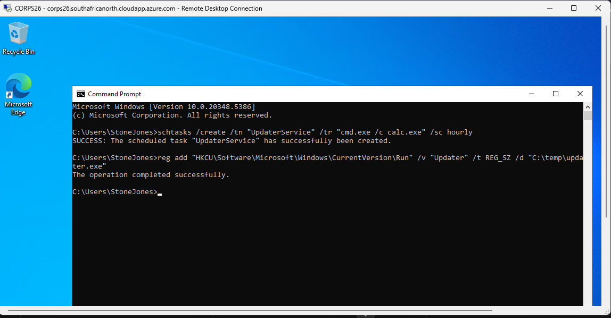
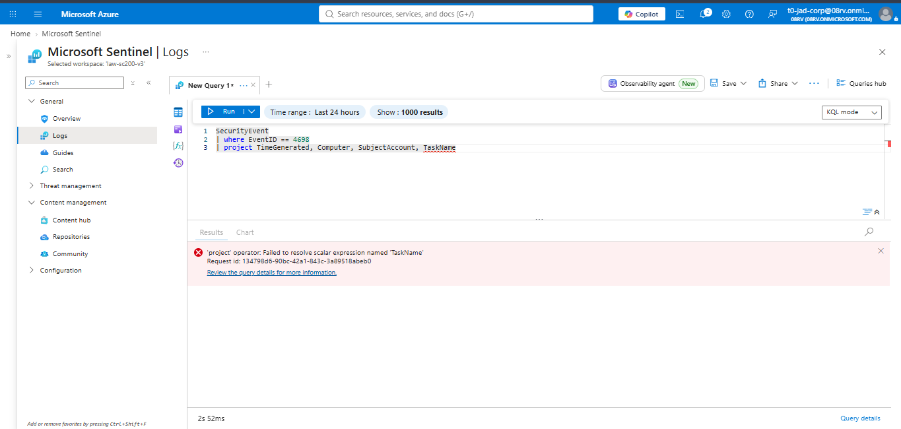

# Reference Run — Persistence (Intentionally Uncontained)
 
## Purpose
 
Every other scenario in this project ends in successful, automated containment. This run is deliberately different: it represents what the environment would look like if every earlier layer — identity containment (Scenario 1), Conditional Access (Scenarios A/B), VM-logon SOAR response (Scenario C), and execution-layer containment (Scenario 3) — had all failed or been bypassed. No detection rule is bound to an automated response here; the goal is purely forensic, to demonstrate what evidence remains to be found by an analyst working an incident after the fact, with no live automation available to help.
 
This run also exists to directly address a structural weakness identified in the original lab syllabus this project was built from: that syllabus placed its only automated response at this exact stage — after persistence was already established — implicitly treating this as the normal, expected point of containment. Every other scenario in this project was built specifically to challenge that assumption by testing containment at earlier, better points in the kill chain. This run preserves that original "last resort" scenario, but reframes it correctly: as the reference case for total containment failure, not as the primary or only response point.
 
## Attack Execution
 
With the NSG deny-all rule from Scenario 3 still active (restricting direct RDP access to the analyst's own whitelisted IP), this persistence action was executed via Azure Run Command rather than a direct interactive RDP session, simulating a case where the attacker retains some alternate execution capability despite network-layer containment already being in place — a realistic possibility if, for example, the attacker had already established a secondary access method before containment occurred.
 
```
schtasks /create /tn "UpdaterService" /tr "cmd.exe /c calc.exe" /sc hourly
reg add "HKCU\Software\Microsoft\Windows\CurrentVersion\Run" /v "Updater" /t REG_SZ /d "C:\temp\updater.exe"
```
 
The first command creates a scheduled task designed to execute hourly, a common persistence mechanism (MITRE ATT&CK T1053, Scheduled Task/Job). The second modifies the current user's Registry Run key, a second, independent persistence mechanism that executes at every interactive logon (MITRE ATT&CK T1547.001, Registry Run Keys / Startup Folder).
 
## Detection Queries — Post-Hoc Only
 
These queries were run manually, after the fact, to demonstrate what would be available to an analyst investigating this stage — no live alert or automated response is attached to either.
 
**Scheduled task:**
```kusto
SecurityEvent
| where EventID == 4698
| project TimeGenerated, Computer, SubjectAccount, TaskName
```
As documented in `docs/securityevent-dcr-gap.md`, this environment's Data Collection Rule was never configured to collect Windows Security Event logs, so this query returns no data here — a real, honestly-reported limitation of this specific rebuilt environment rather than evidence that scheduled task creation is undetectable in general. In a correctly configured environment, this event ID is a reliable, well-documented detection point for exactly this technique.
 
**Registry persistence:**
```kusto
Event
| where Source == "Microsoft-Windows-Sysmon"
| where EventID == 13
| where EventData has "Updater"
| project TimeGenerated, Computer, EventData
```
 
**Note on Event ID selection:** this query correctly uses Event ID 13 (Registry Value Set), not Event ID 12 (Registry Object Create/Delete). This distinction was established earlier in this project, during Scenario 3's execution-layer testing, after initially and incorrectly assuming a `reg add` operation on an existing key would log as Event ID 12. A `reg add` targeting an existing key path (as used here, adding a value under the already-existing `Run` key) is a value-set operation and logs as Event ID 13; only the creation or deletion of a registry *key* itself logs as Event ID 12.
 
The expanded event payload confirms `RuleName: T1060,RunKey` — a MITRE ATT&CK technique tag present in this environment's Sysmon configuration (Olaf Hartong's `sysmon-modular` ruleset, which includes ATT&CK-mapped rule names; this is a property of the specific Sysmon configuration used, not a default Sysmon capability) — along with the correct target registry path and the acting user.
 
## Findings
 
- Registry-based persistence was successfully captured with full attribution, MITRE technique tagging, and the exact value written, confirming this detection layer functions correctly and independently of the missing Security Event log source.
- Scheduled task creation could not be verified in this specific environment due to the documented DCR scope gap — an honest limitation rather than a claim that this technique is undetectable.
- If both persistence mechanisms are considered together, an analyst reviewing only what this environment actually captured would still have clear, attributable evidence of at least one working persistence mechanism, sufficient to drive remediation (removing the Run key, reversing account compromise via the earlier scenarios' findings) even without the scheduled task evidence.
## Why This Run Was Left Uncontained
 
This is the deliberate design point of this reference run: it exists specifically to be the case that isn't caught in real time, so that its documentation can honestly demonstrate the value of the earlier, better-positioned containment layers built throughout the rest of this project. A reader comparing this run against Scenarios 1, C, and 3 should come away with a concrete sense of the difference between "an attacker's actions were stopped within minutes" and "an attacker's actions are found during forensic review after the fact" — and why a real SOC's investment in earlier-layer detection and automated response has real, measurable value.
 
## Artifacts Captured
 
**Raw EventData** for the registry persistence event (Event ID 13), showing full attribution and MITRE technique tagging:

 
**Run Command output** confirming the persistence commands executed successfully on the VM:

 
**SecurityEvent query resolution error**, documenting the absence of scheduled task telemetry (Event ID 4698) in this environment — the query fails to resolve entirely, as `SecurityEvent` has no established schema in this workspace, confirming no Data Collection Rule was ever configured to populate it:

