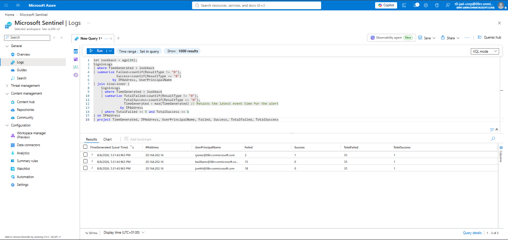
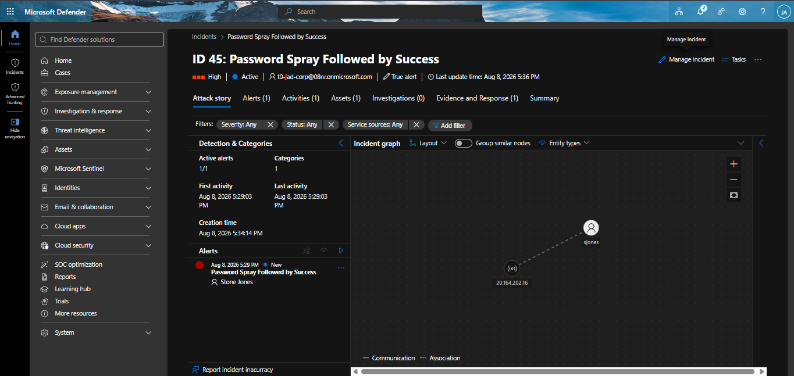
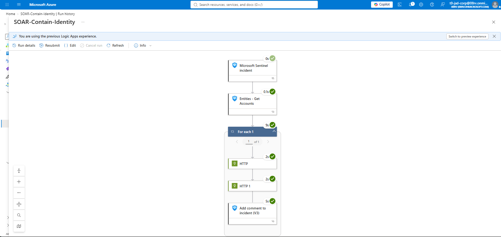
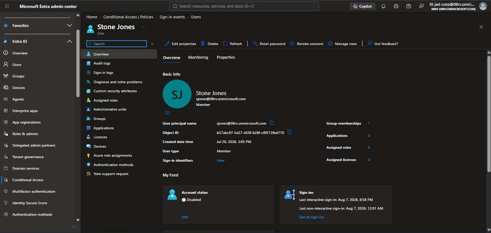

# Scenario 1 — Identity Layer Containment
 
## Objective
 
Determine whether Microsoft Sentinel can detect a password spray attack against Entra ID identities and automatically contain the compromised account before the attacker can reuse the stolen credentials against any other resource. This is the first and earliest layer in the overall kill-chain: if this containment works, the attacker never gets far enough to reach the VM, a cloud application, or anything downstream.
 
## Why a password spray, specifically
 
A password spray (many accounts, few attempts each, one shared password guess) was chosen over a brute force (one account, many passwords) because it's the more realistic pattern for a real-world external attacker who has no prior knowledge of which accounts exist or which passwords are strong — and because it produces a distinctive telemetry signature (many distinct accounts, low per-account attempt count, single source IP, tight time window) that is genuinely different from normal failed-login noise, making it a good candidate for a first detection rule.
 
## Environment for this scenario
 
- **Attacker origin:** Ubuntu Server 22.04 LTS VM (Azure), running a bash script using the ROPC (Resource Owner Password Credentials) OAuth flow against `https://login.microsoftonline.com/{tenant}/oauth2/v2.0/token`
- **Client ID used:** `04b07795-8ddb-461a-bbee-02f9e1bf7b46` (Microsoft Azure CLI's first-party application ID) — chosen because it is pre-consented in every tenant, meaning no app registration or admin consent step was needed before the spray could run. This is also realistic: real-world spray tooling (e.g. MSOLSpray) commonly abuses the same pre-consented first-party client IDs for exactly this reason.
- **Scope used:** `https://graph.microsoft.com/.default`
- **Targets:** `jsmith`, `bwilliams` (never actually compromised — decoys/noise accounts), `sjones` (the account with a correct password on file, representing the "weak/guessed" credential)
## Attack Execution
 
The script performed:
1. 5 login attempts for `jsmith` using an intentionally wrong password
2. 5 login attempts for `bwilliams` using the same wrong password
3. 1 login attempt for `sjones` using the correct password
All 11 requests originated from the attacker VM's public IP, executed in immediate succession (roughly one request per second, with a 1-second sleep between each to avoid hitting any throttling).
 
### Real errors encountered while building this attack (worth documenting — this is genuinely part of the engineering work)
 
- An early version of the script had unescaped `!` characters in the password strings, which bash interpreted as history-expansion operators, silently stripping the password parameter from the request entirely. This produced a misleading `AADSTS900144` ("missing password parameter") error that had nothing to do with credentials being wrong — it was a shell-quoting bug. Fixed by single-quoting password values.
- An early version also used a fabricated/placeholder client ID, which is not a valid, tenant-recognized application — this failed with `AADSTS700016` ("application not found in tenant"), a reminder that a client ID for ROPC testing must be a real, pre-existing first-party or self-registered application, not an arbitrary GUID.
- A wrong Graph scope (`user.read openid profile offline_access` instead of `https://graph.microsoft.com/.default`) produced `AADSTS65002` (consent-between-application-and-resource not configured) — the first-party Azure CLI client ID is only pre-consented for the `.default` scope pattern in this tenant, not for arbitrary delegated scopes.
## Detection Logic
 
**Design goal:** identify a real spray pattern (many failures, one success, same source, tight window) while correctly attributing the eventual success to the specific account that was compromised — not to every account that was merely targeted.
 
**Key engineering decision — per-account vs per-IP aggregation:** an early version of this query aggregated failed/success counts purely by IP address, then used `mv-expand` to break a `make_set()` of targeted usernames back into individual rows. This technically worked for entity mapping, but had a real flaw: the `Failed` and `Success` counts were IP-level aggregates, identically duplicated across every expanded row — meaning the query could not actually tell you *which* of the three targeted accounts was the one that succeeded. The final version instead correlates at the IP level first (to confirm a genuine spray pattern exists), then separately identifies which specific account(s) succeeded from that IP — giving unambiguous, per-account attribution suitable for driving an automated response against the correct identity only.
 
See the full query in `detections/scenario1_password_spray.kql`.
 
**Entity mapping:** Account entity mapped to the compromised `UserPrincipalName`; IP entity mapped to the attacking `IPAddress`. This mapping is what allows the downstream Logic App to know exactly which account to act on, without hardcoding a username anywhere in the automation.
 
**Scheduling:** the rule runs every 15 minutes, looking back over a rolling window sized to comfortably contain the full spray-to-success sequence even if there's some delay between the failed attempts and the eventual successful login.
 
## Response Design
 
**Chosen actions:** disable the account, then revoke all active sign-in sessions — implemented as two sequential Microsoft Graph API calls from the Logic App, authenticated via the Logic App's own system-assigned managed identity rather than a stored credential.
 
**Implementation notes:** the compromised account was resolved directly from Sentinel's native "Entities - Get Accounts" connector action rather than manually parsing incident JSON, and the account's UserPrincipalName was used directly in the Graph API request URIs rather than performing a separate preliminary lookup for the account's Object ID — Microsoft Graph's `/users/{id}` endpoint accepts either interchangeably, making the extra lookup unnecessary.
 
- `PATCH https://graph.microsoft.com/v1.0/users/{id}` with body `{"accountEnabled": false}`
- `POST https://graph.microsoft.com/v1.0/users/{id}/revokeSignInSessions`
**Why both actions, not just one:** disabling the account prevents *future* password-based authentication, but does not by itself invalidate tokens the attacker may have already obtained in the same session that triggered the alert. Revoking sessions separately forces re-authentication everywhere, closing that gap. Using both together is standard identity-containment practice, not redundant.
 
**Why managed identity over a stored credential:** a stored service account credential embedded in the Logic App would itself become a target and a maintenance burden (rotation, exposure risk). The system-assigned managed identity has no credential to leak, and is the pattern Microsoft recommends for exactly this kind of automation.
 
**Note on notification design:** this playbook logs its containment action directly to the Sentinel incident (comments/tags) rather than sending an external notification (email/Teams). This is a reasonable choice for a lab environment under direct, active observation, but worth flagging as a real limitation for production use: without an external notification channel, an automation failure (as actually occurred once in Scenario C's cloned playbook, before its permissions issue was found) could go unnoticed unless an analyst happens to be actively watching the incident queue at the time.
 
**Authorization mechanism actually used:** the original plan was to grant the managed identity the Microsoft Graph `User.ReadWrite.All` **application permission** via PowerShell. This approach hit friction during setup, and was ultimately replaced with a simpler alternative: assigning the built-in Entra ID **User Administrator** directory role directly to the managed identity through the Entra ID portal. This is a real, functioning authorization path — it inherently carries the rights needed to disable a user and revoke sign-in sessions — but it is a broader-scoped mechanism than the originally intended Graph permission, since it grants standing administrative rights over any non-privileged user in the tenant, not just the specific Graph API calls this playbook makes. This tradeoff, and why it is worth flagging as a least-privilege consideration rather than treating as simply "the better approach," is documented in `docs/logic-app-permissions-graph-vs-directory-role.md`.
 
## Timeline
 
| Time | Event |
|---|---|
| T+0 | Spray script executed from attacker VM |
| T+0 – T+10s | 5 failed logins recorded for `jsmith`, 5 for `bwilliams` |
| T+10s | 1 successful login recorded for `sjones` |
| T+15min (next rule cycle) | Analytics rule evaluates, correctly identifies `sjones` as the compromised account, Sentinel incident created |
| T+15min | Logic App triggers automatically via the incident's automated response binding |
| T+15min | Graph API disables `sjones` |
| T+15min | Graph API revokes all active sessions for `sjones` |
| T+16min | Entra ID confirms account status: Disabled |
 
## Outcome
 
The attacker's stolen credential for `sjones` was rendered unusable within one detection cycle of the successful login — before any further scenario (cloud app access, VM RDP, or execution) could occur using that same credential. This validates the identity layer as a genuinely effective first line of defense in the overall kill chain, and establishes the baseline "SOAR disable + revoke" pattern reused (and, in Scenario C, critically limited) later in this project.
 
## Artifacts Captured
 
**Spray script terminal output** (all 11 requests, real HTTP responses shown, not suppressed):

 
**KQL detection query result** showing correct per-account attribution:

 
**Sentinel incident** with Account and IP entities correctly mapped:

 
**Logic App run history** showing both Graph API actions succeeded:

 
**Entra ID portal confirmation** of `sjones` account disabled status:

 
## Reset
 
`sjones` account re-enabled in Entra ID following artifact capture, restoring baseline state for subsequent scenarios.