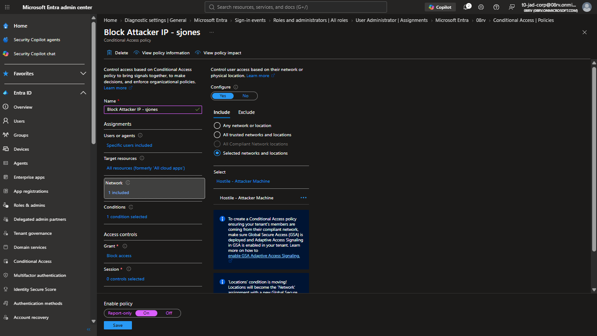
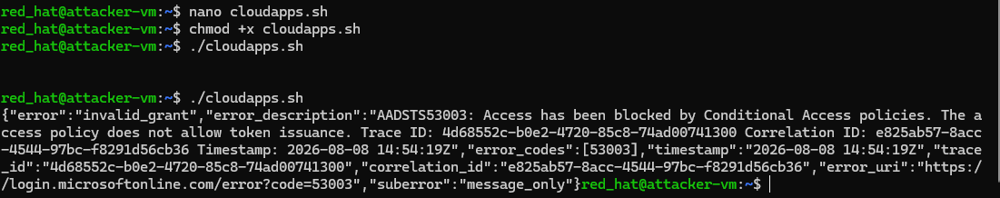
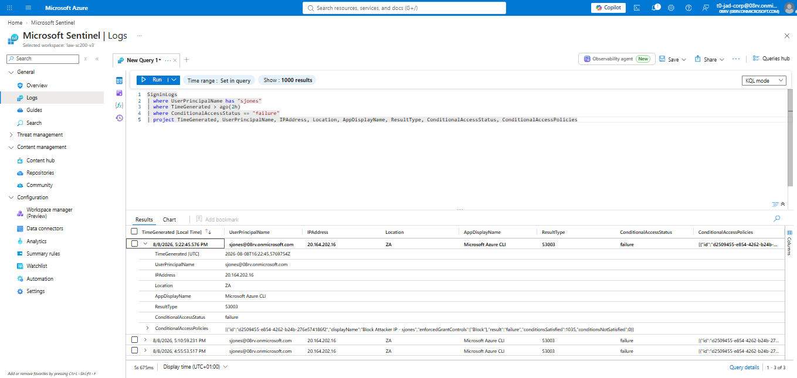

# Scenario A — Cloud App Access: Conditional Access Block
 
## Objective
 
Determine whether Conditional Access can stop a compromised identity from being used against a second resource — specifically a cloud application — once credentials have already been stolen via the Scenario 1 password spray. This scenario tests a preventive control (block before any incident is even generated), in contrast to Scenario 1 and Scenario C, which are both detective/responsive controls (something happens, then Sentinel reacts).
 
## Why cloud app access, and not RDP, for this specific control
 
This is one of the more important design decisions in the whole project, so it's worth documenting the reasoning in full rather than just stating the conclusion.
 
The original intention was to test Conditional Access directly against RDP access to the lab VM — location-based blocking of "attacker tries to RDP in from a suspicious network." During early testing, this was found not to work, for a specific, verifiable reason: when a user authenticates to an Entra ID Joined VM via RDP, the sign-in event that Entra ID actually records reflects the **VM's own device authentication to Entra ID** (via its Primary Refresh Token), not the network location of whoever is sitting at the RDP client. In other words, the "IP address" and "location" fields on an RDP-to-Entra-joined-VM sign-in are always the VM's own fixed position — regardless of whether the person RDPing in is on their home network, a coffee shop, a VPN, or Tor.
 
This was confirmed empirically, not just reasoned about: a test RDP login was attempted while routed through a VPN exit node in a different country, specifically to see if Entra ID's sign-in log would reflect that changed network origin. It did not — the logged IP address and location remained the VM's own, and Conditional Access, which depends on this location data to make blocking decisions, had nothing meaningful to evaluate. This same finding is what led to Scenario B being documented as a limitation rather than a working control (see `reports/scenarioB-limitation-analysis.md`).
 
Given this, Conditional Access location-based blocking was moved to a use case where it can actually function: cloud application sign-in (e.g. `portal.azure.com`, `myapps.microsoft.com`, or in this test's case, the Microsoft Graph resource directly), where the client's real IP address is transmitted to Entra ID as part of the normal OAuth sign-in flow. This is the same reason Scenario C exists as a separate scenario — to specifically cover the VM-logon access path that Conditional Access, for the reason above, cannot gate.
 
## Environment for this scenario
 
- Compromised identity: `sjones` (from Scenario 1)
- Target resource: Microsoft Graph, accessed via a cloud-app-style sign-in rather than the VM's RDP sign-in application
- Attacker origin for this test: the Ubuntu attacker VM's own public IP — the same machine used for the Scenario 1 spray, deliberately targeted by the Conditional Access policy itself, rather than testing from a separate, unrelated untrusted network
## Conditional Access Policy Configuration
 
- **Users:** `sjones` (scoped narrowly to this test account, not tenant-wide, to avoid any risk of locking out the operator's own account during testing)
- **Target resources:** All cloud apps (a specific "Azure VM Sign-In" application could not be reliably located/confirmed in this tenant's Enterprise Applications list — using the broad scope avoids depending on an unverified application identifier)
- **Conditions:** Locations — a named location was configured containing the attacker VM's specific public IP (as a /32), and the policy was scoped to block sign-in specifically from that named location, rather than allow-listing the operator's own trusted location and blocking everything else. This directly targets the actual attacker infrastructure used throughout this project, rather than an arbitrary or generic "untrusted" range.
- **Grant:** Block access
- **State:** On
## Attack Execution
 
The attacker environment (the Ubuntu VM) is command-line only, with no browser available, so a standard interactive sign-in flow could not be used to test the block. Instead, a curl-based ROPC (Resource Owner Password Credentials) request was made from the attacker VM using the `sjones` credentials, targeting Microsoft Graph as the resource — the same authentication mechanism used throughout this project for the Scenario 1 spray script, reused here as the closest achievable equivalent to a cloud-app sign-in attempt originating from the specifically blocked IP.
 
**Note on this testing approach:** ROPC is a non-interactive, legacy-style authentication flow, and it is not guaranteed to be evaluated by Conditional Access identically to a full interactive browser-based sign-in in every tenant configuration. This is a real limitation of testing from a CLI-only attacker environment rather than a browser-capable client, and is worth flagging explicitly if this scenario is ever reproduced with an interactive-capable client instead — the result may differ.
 
## Result
 
The sign-in attempt was blocked directly by Conditional Access, before authentication could complete and before any Sentinel analytics rule ever had the opportunity to evaluate it. This is an important structural distinction from every other scenario in this project: Scenario A does not generate a Sentinel incident, and correctly should not — Conditional Access is a prevention control operating entirely within Entra ID's own authentication pipeline, upstream of any SIEM visibility. An earlier draft of this project's documentation (informed by an AI-generated artifact list) incorrectly implied that this scenario should also produce a Sentinel incident and a SOAR playbook run; this was identified as a genuine conceptual error and corrected — see the note on this in `docs/` lessons-learned material.
 
## Verification
 
```kusto
SigninLogs
| where UserPrincipalName has "sjones"
| where TimeGenerated > ago(2h)
| where ConditionalAccessStatus == "failure"
| project TimeGenerated, UserPrincipalName, IPAddress, Location, AppDisplayName, ResultType, ConditionalAccessStatus, ConditionalAccessPolicies
```
 
The `ConditionalAccessPolicies` field, when expanded, confirms the specific policy built for this scenario as the one that enforced the block, and `ConditionalAccessStatus` shows `failure` — the sign-in never succeeded at the identity provider level.
 
## Outcome
 
Even with valid, correctly-entered credentials, the compromised identity could not be used to authenticate from the specifically blocked attacker infrastructure. This demonstrates a genuinely effective preventive control at the identity layer — distinct from Scenario 1's detective/responsive control — and establishes the baseline for what Conditional Access can and cannot cover across this project (contrast directly with Scenario B).
 
## Artifacts Captured
 
**Conditional Access policy configuration** (named location, block grant):

 
**curl/ROPC request output** showing the block response:

 
**KQL query and expanded result** showing the blocked sign-in and the enforcing policy name:

 
## Reset
 
Conditional Access policy disabled following artifact capture, to allow Scenario C's successful-sign-in test to proceed without interference.
 