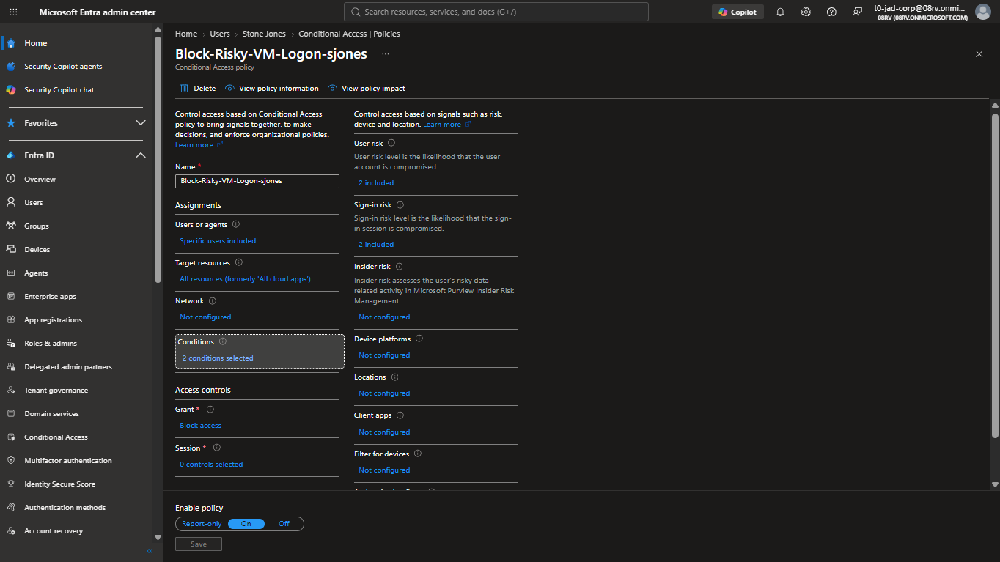
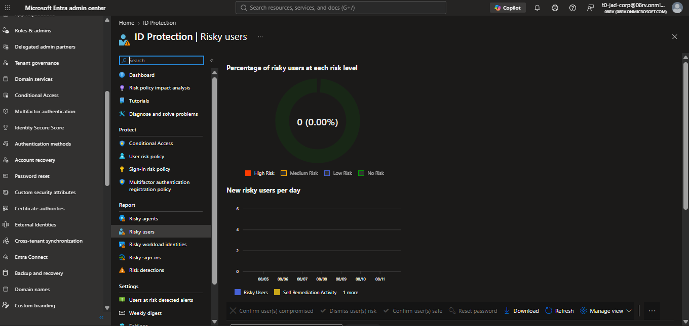
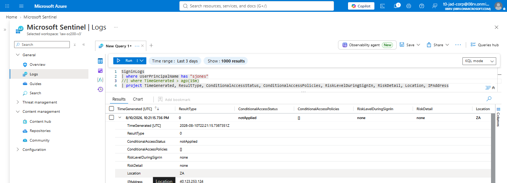

# Scenario B — VM Logon, Risk-Based Conditional Access: Limitation Analysis
 
## Objective
 
Determine whether Conditional Access, using Identity Protection's risk-based conditions (User Risk and Sign-in Risk) rather than location-based conditions, could gate RDP access to the Entra ID Joined VM — providing a second, independent Conditional Access mechanism distinct from Scenario A's location-based block on cloud app access.
 
This scenario is documented in full even though it does not produce a working control, because the reasoning behind why it fails is itself a genuine, defensible technical finding — arguably more valuable for demonstrating real understanding than a scenario that simply worked as expected.
 
## Why this scenario was attempted at all
 
Scenario A established that location-based Conditional Access cannot meaningfully gate RDP-to-Entra-joined-VM sign-ins, because that authentication flow never transmits the client's real network location to Entra ID — only the VM's own fixed position. Before concluding that Conditional Access has no role to play in gating VM logons at all, it was worth testing whether a *different* condition — one that doesn't depend on network location — might succeed where location-based policy failed. Risk-based conditions (Identity Protection's User Risk and Sign-in Risk scores) were the obvious candidate, since these are computed from behavioral and threat-intelligence signals rather than purely from the client's IP/location.
 
## Policy Configuration
 
- **Users:** `sjones`
- **Target resources:** All cloud apps (the same scoping limitation as Scenario A applies — no verifiable, tenant-specific "Azure VM Sign-In" application identifier was available to scope this more narrowly)
- **Conditions:** User risk (High, Medium) OR Sign-in risk (High, Medium)
- **Grant:** Block access
- **State:** On
Both risk conditions were configured together (rather than only one) specifically to maximize the chance of catching *some* risk signal — sign-in risk evaluates in real time at the moment of authentication, while user risk is a more aggregate, aging score tied to the account itself, and it was not obvious in advance which (if either) would actually reflect the prior password spray.
 
## Testing Process and Findings
 
**Step 1 — check for pre-existing risk.** Before attempting to force a risk signal, `sjones`'s current risk state was checked in Identity Protection's Risky Users list. The account showed no risk at all, despite having been the target of a real, detected password spray in Scenario 1. This is itself a notable finding: **Sentinel's own custom analytics rule detecting the spray and Identity Protection's separate, Microsoft-managed risk engine are not connected.** A Sentinel incident firing does not automatically feed back into Identity Protection's risk score — these are two entirely independent detection systems unless explicitly integrated (for example, by having a Logic App call the Identity Protection API to manually mark a user at-risk in response to a Sentinel incident, which was not built in this project but is a recognized real-world integration pattern).
 
**Step 2 — attempt to force a risk signal.** Since no natural risk signal existed, one was deliberately forced by routing the RDP connection through a VPN exit node in a foreign location — the same technique used to test (and disprove) location-based Conditional Access on RDP in earlier troubleshooting. The RDP login succeeded normally through the VPN.
 
**Step 3 — check the resulting sign-in telemetry.**
 
```kusto
SigninLogs
| where UserPrincipalName has "sjones"
| where TimeGenerated > ago(15m)
| project TimeGenerated, ResultType, ConditionalAccessStatus, ConditionalAccessPolicies, RiskLevelDuringSignIn, RiskDetail, Location, IPAddress
```
 
Result: `ConditionalAccessStatus: notApplied` — the policy never even evaluated. `RiskLevelDuringSignIn: none`. `IPAddress` and `Location` both reflected the VM's own fixed position, not the VPN exit node's IP or country, confirming the same telemetry blindness already established for location-based Conditional Access.
 
## Root Cause
 
This is a structural limitation, not a misconfiguration. RDP-to-Entra-joined-VM authentication does not carry the connecting client's true network context to Entra ID at all — regardless of whether that context would be evaluated by a location condition or a risk condition. Since Sign-in Risk depends heavily on anomalous-location and anomalous-IP signals to compute a real-time risk score, and User Risk (in this environment) was never populated by any external threat-intelligence signal or manual escalation from the Sentinel-side detection, there was no available mechanism to generate a genuine risk score for this sign-in — with or without a VPN, with or without repeated attempts.
 
## Why This Matters, Beyond This Lab
 
This represents a genuine, real-world blind spot worth understanding: an organization that relies on Conditional Access — location-based or risk-based — as its primary control for RDP access to Entra ID Joined virtual machines has a structural gap that neither policy type can close, because the underlying authentication telemetry for this specific access path does not carry the information either control needs. Effective containment for this access path has to come from a different layer entirely — which is exactly what Scenario C (SOAR responding to a successful VM logon) was built to demonstrate, and is the direct answer to the question this scenario's failure raises: if Conditional Access cannot gate this access path, what can?
 
## Outcome
 
Scenario B did not function as a working preventive control. It is retained in this project as a documented, empirically-verified architectural limitation, and directly motivates the design of Scenario C as the correct containment layer for this specific access path.
 
## Artifacts Captured
 
**Conditional Access policy configuration** (risk-based conditions):

 
**Identity Protection Risky Users view** showing no risk flagged on `sjones` despite the prior detected spray:

 
**KQL query result** showing `ConditionalAccessStatus: notApplied`, `RiskLevelDuringSignIn: none`, and VM-origin IP/location despite VPN routing:

 
## Reset
 
Policy left disabled after testing; no account state changes were made in this scenario since no block was ever actually enforced.