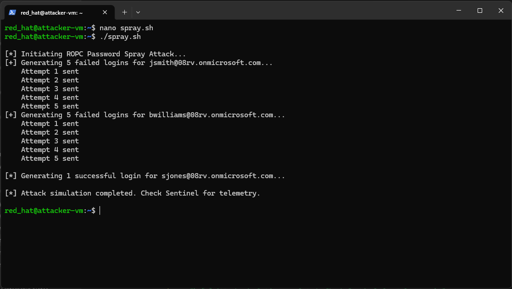
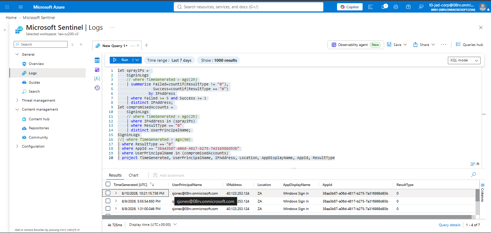
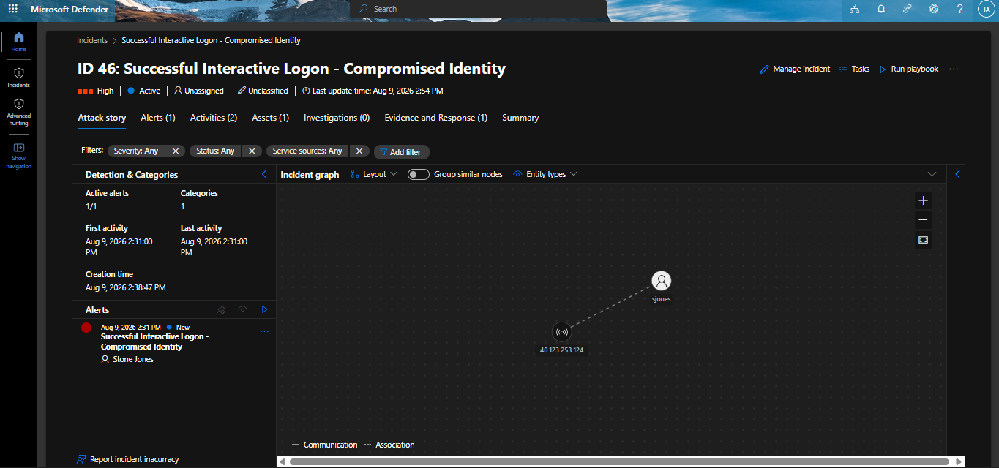
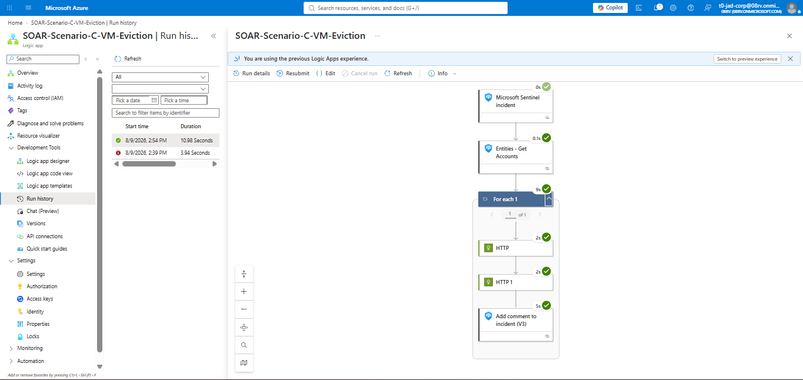
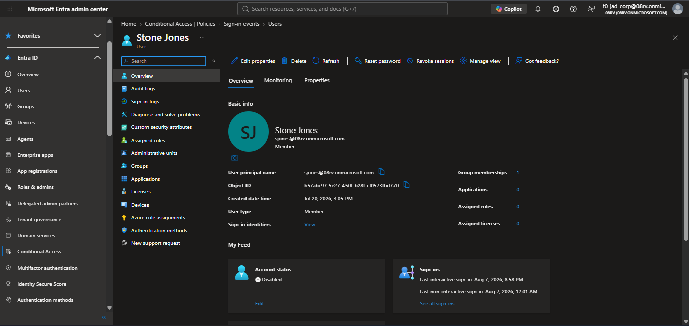
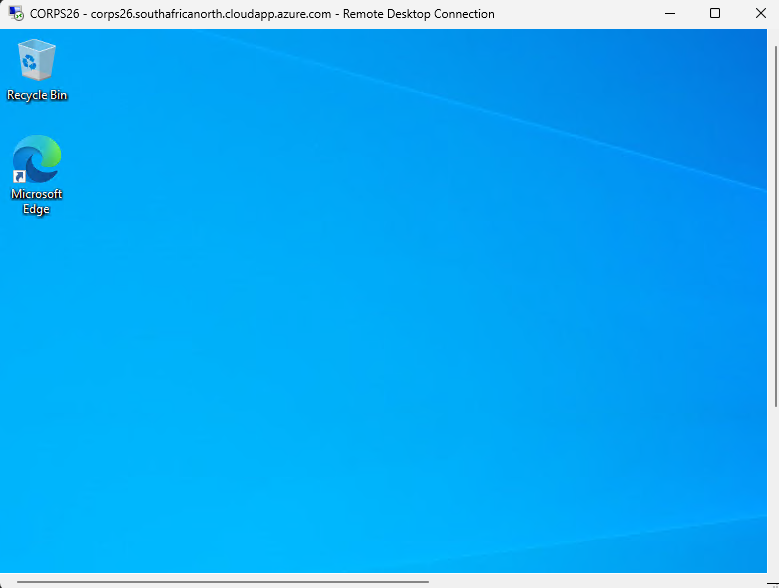

# Scenario C — VM Logon: SOAR Response
 
## Objective
 
Determine whether Sentinel can detect and automatically contain a case where a previously-compromised identity successfully reaches the VM via RDP — the specific access path that Scenario B established Conditional Access cannot gate, for either location-based or risk-based conditions. This scenario is the direct answer to the gap Scenario B's failure exposed: if Conditional Access cannot prevent this access, can detection and response still catch it after the fact.
 
## Why this scenario had to exist independently of Scenario 1
 
An early design question worth documenting: since Scenario 1 already disables the account the moment the password spray is detected, why is a second, separate detection needed for the VM logon at all? In a fully working environment, Scenario 1's containment should prevent the attacker from ever reaching the VM in the first place, making Scenario C's detection redundant.
 
The honest answer, arrived at through direct discussion rather than assumed in advance, is that Scenario C exists to model the realistic case where the identity-layer control did *not* catch the intrusion in time — whether due to detection latency (the up-to-15-minute gap between the spray happening and the rule's next scheduled evaluation), a SOAR playbook requiring human approval before disabling a business-critical account, an automation failure (expired permissions, an API error), or simply a fast attacker who reaches the VM before Scenario 1's cycle completes. To test Scenario C at all, Scenario 1's automation had to be deliberately disabled during testing — which is itself the point: Scenario C is the second, independent chance to stop the same intrusion if the first layer is bypassed, delayed, or fails. This is exactly what defense-in-depth means in practice, not just as a diagram concept.
 
## Detection Logic — the correlation problem and its fix
 
The first version of this detection simply alerted on any successful sign-in by `sjones` to the VM sign-in application, with no reference to the earlier spray at all. This was identified as a poor design during review: a rule that disables an account the instant it logs in successfully, with no behavioral justification, is not a real detection — it is indistinguishable from simply breaking the account's ability to function. A real analyst reviewing this rule would reasonably ask why any successful login should be treated as an incident.
 
The corrected design explicitly correlates the VM logon back to the original spray:
 
1. Identify the source IP address responsible for a genuine spray pattern (5+ failures, 1+ success) within a rolling lookback window
2. Identify which specific account succeeded from that IP — the actual compromised identity
3. Check whether that same account subsequently produces a successful sign-in to the VM's specific application ID, within a short, near-real-time window
This means the rule only fires when there is a real, traceable link between an earlier detected compromise and a later access attempt — not simply "this account logged in."
 
**A second, separate bug was found and fixed during testing:** an earlier version of the correlation grouped failed and successful attempts by both `UserPrincipalName` and `IPAddress` together. This silently broke the correlation, because the VM logon's IP address (the VM's own fixed position, per the finding in Scenario A/B) is never the same as the attacker VM's IP address used during the original spray. Grouping by IP caused the query to look for one account with both 5+ failures and a success *from the same IP*, which no single account ever has — the spray's failures and success occurred at the IP level across multiple accounts, and the later VM logon occurs from an entirely different IP. The fix was to identify the compromised account from the IP-level spray pattern first, then check for that account's success independently of IP at the second stage. This IP-correlation issue cost significant debugging time and is documented in more technical detail with the actual query evolution.
 
**A third issue** was a hardcoded, unverified application ID for the VM sign-in app, initially asserted without confirmation. This was checked directly against the tenant's actual sign-in telemetry (`SigninLogs` filtered to a known successful `sjones` RDP session, projecting the `AppId` field) rather than trusted at face value, and the real value was found to differ from what was initially assumed. The corrected, verified AppId was used in the final rule.
 
See the full, corrected query in `detections/scenarioC_soar_vm_logon.kql`.
 
**Entity mapping:** Account → `UserPrincipalName`, IP → `IPAddress`.
 
**Scheduling:** rule runs every 5 minutes; the outer "lookup data from the last" window is set to 2 hours (not 5 minutes) — this was a specific, deliberate correction. The rule's internal correlation logic needs access to spray data that may be up to 2 hours old, and Sentinel's "lookup data from the last" setting restricts the *entire* query's visible data, including data referenced inside `let` statements — a 5-minute outer window would silently prevent the correlation subquery from ever seeing the earlier spray, regardless of what the query text itself specifies. The final 5-minute inner filter (restricting the *alerting* condition to only recent VM logons) remains inside the query text itself, working correctly within the wider 2-hour data-access window.
 
## Response Design
 
Identical action pattern to Scenario 1: disable the account, then revoke all active sessions, via Microsoft Graph API using a Logic App's managed identity. This Logic App was built by cloning Scenario 1's playbook rather than rebuilt from scratch, since the underlying containment logic is the same — only the trigger (this scenario's analytics rule, not Scenario 1's) differs.
 
**A permissions gap was found and fixed during testing:** the cloned Logic App received its own new, separate managed identity, which did not automatically inherit any authorization granted to Scenario 1's original identity. The first test run failed with `Authorization_RequestDenied` / "Insufficient privileges." This was resolved by assigning the built-in Entra ID **User Administrator** directory role directly to this Logic App's managed identity via the Entra ID portal — the same authorization mechanism ultimately used in Scenario 1, after the originally intended Microsoft Graph `User.ReadWrite.All` application permission approach hit setup friction. The failed run was then manually re-submitted to confirm the fix without needing to regenerate the whole attack chain. See `docs/logic-app-permissions-graph-vs-directory-role.md` for the reasoning behind this authorization choice and its least-privilege tradeoff.
 
## Notable Finding — session persistence after containment
 
After the Logic App successfully disabled the account and revoked sessions, the attacker's already-active RDP session **remained connected**. This is a real, verified finding, not an oversight: disabling an account and revoking sign-in sessions governs future authentication and token-based access, but does not retroactively terminate a session that was already established before the containment action ran. Windows does not re-validate an interactive session's underlying credential mid-session. This same behavior is independently confirmed in Scenario 3, where it directly motivated the design of that scenario's three-part containment (which explicitly includes forced session logoff, not just network-layer blocking).
 
## Timeline
 
| Time | Event |
|---|---|
| T+0 | Scenario 1's automation rule manually disabled to allow this scenario to be tested in isolation |
| T+0 | Fresh password spray run from the attacker VM (required — the original spray had aged out of the 2-hour correlation window by the time this scenario was tested) |
| T+~10s | `sjones` successful login recorded, as in Scenario 1 |
| T+shortly after | RDP login to the VM as `sjones`, using the working Entra ID RDP configuration |
| T+up to 5min | Analytics rule correlates the spray and the VM logon, Sentinel incident created |
| T+5min | Logic App triggers, Graph API disables `sjones` and revokes sessions |
| T+5min | Entra ID confirms account disabled |
| — | Active RDP session observed to remain connected despite successful containment |
 
## Outcome
 
Sentinel successfully detected and contained a compromised identity reaching the VM via RDP — the exact access path Scenario B proved Conditional Access cannot gate — using behavioral correlation rather than a naive "any login" rule. The scenario also surfaced a genuine, reusable finding (identity actions do not equal session termination) that directly shaped the design of Scenario 3.
 
## Artifacts Captured
 
**Fresh spray script output** and successful `sjones` VM logon confirmation:

 
**KQL correlation query result** showing the linked spray-to-VM-logon detection (time filters removed for this test to confirm the correlation logic itself, independent of the deployed rule's scheduling window — see `detections/scenarioC_soar_vm_logon.kql` for the production version):

 
**Sentinel incident** with Account entity correctly mapped:

 
**Logic App run history** (post-permission-fix), both Graph API actions succeeded:

 
**Entra ID confirmation** of disabled account:

 
**Still-active RDP session** despite containment, alongside the disabled account status:

 
## Reset
 
`sjones` re-enabled; Scenario 1's automation rule re-enabled to restore full baseline defense-in-depth coverage before proceeding to Scenario 3.